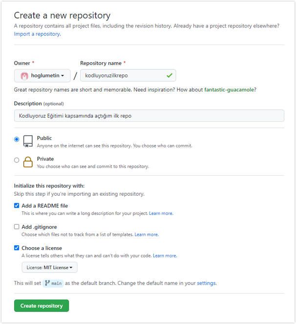

# Kodluyoruz Ilk Repo

Bu repo [Kodluyoruz](https://www.kodluyoruz.org) Front-End Eğitiminde oluşturduğumuz ilk repo. İçerisinde bir adet READMEdosyası, bir adet de index.html barındırıyor.



## Installation

Öncelikle projeyi clone'layın. [Proje Linki](https://github.com/hoglumetin/kodluyoruzilkrepo.git)

```
git clone https://github.com/hoglumetin/kodluyoruzilkrepo.git
```

## Usage

Projeyi clone'ladıktan sonra Visual Studio Code programında açınız.

Linux için:

```
cd kodluyoruzilkrepo
code .
```

## Contributing

Pull requestler kabul edilir. Büyük değişiklikler için, lütfen önce neyi değiştirmek istediğinizi tartışmak için bir konu açınız.

## License

[MIT](https://choosealicense.com/licenses/mit/)